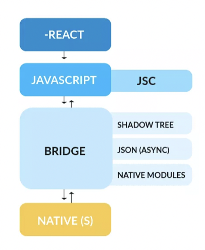
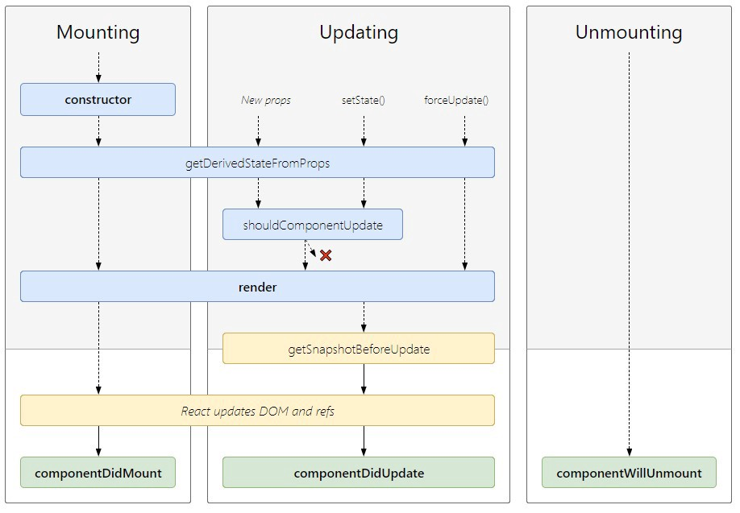
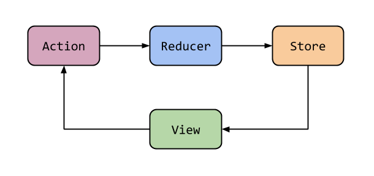
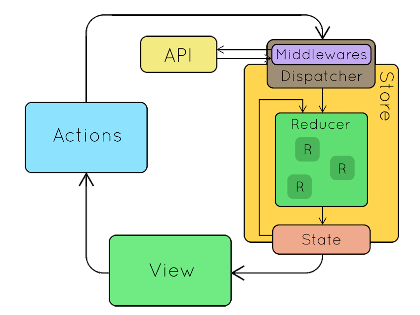

# Deloitte Base

Deloitte Base React-Native Mobile Application

## Setup Mac or Windows
    - Homebrew (mac only):
        open terminal and exceute -> ruby -e "$(curl -fsSL https://raw.githubusercontent.com/Homebrew/install/master/install)" brew doctor
    - Watchman: 
        mac: open terminal and exceute -> brew install watchman 
        windows: 
            1. Load watchman archive from https://facebook.github.io/watchman/docs/install.html;
            2. Create folder watchman in c:\Users\USERNAME\AppData\Local
            3. Extract watchman archive to watchman folder. You must get c:\Users\USERNAME\AppData\Local\watchman\watchman.exe
            4. Open path environment in
                - click on luppa (find) and insert settings: Edit the system environment variables ->  Environment variables
                - OR System -> System Info -> Advance system settings -> Advance (tab) -> Environment variables
            5. Set add to inviroment path c:\Users\USERNAME\AppData\Local\watchman
            6. Re CONTACT in you system or reboot PC
            7. Open terminal and run command watchman -v and you must see version

    - Node: 
        mac: open terminal and exceute -> brew install node@12 or open and download from website https://nodejs.org/en/download/
        windows: open and download from website https://nodejs.org/en/download/

    - react-native: open terminal and exceute npm install -g react-native-cli

    - yarn: 
        mac: open terminal and exceute -> brew install yarn
        windows: open and download from website https://yarnpkg.com/lang/en/docs/install/#windows-stable

    - java: open and download from website https://www.java.com/en/download/

    - xcode: download from Appstore (mac only), download juga simulatornya di tab xcode -> Preferences,
             pilih component dan download simualtor version 10.0 dan latest version

    - android studio: open and download from website https://developer.android.com/studio/?gclid=CjwKCAiA6vXwBRBKEiwAYE7iS3qrajYtoaoUcRGukCU40hYJwvE-uxdR8qm1xf39uQrD3jMgrb-3QhoCNLcQAvD_BwE

    - Git: 
        mac: open terminal and exceute -> brew install git
        windows: open and download from website https://gitforwindows.org/

    - Cocoapods (mac only): open terminal and exceute -> sudo gem install cocoapods

    - VS Code (optional): open and download from website https://code.visualstudio.com/

## Setup project
    - install Pod for iOS project (mac only):
        - go to the ios/ folder on the terminal
        - execute : pod install
        *note: delete / delete the Podfile.lock file if needed, so that there is no difference between the native ios pod version and the library in node modules
    - environment on rga test:
        - There are 3 endpoint/API environments in the rga test, namely DEV, SIT, PreProduction and Production. To run (RUN) there is the following command:
            - DEV:
                android: react-native run-android
                ios: react-native run-ios
            - SIT:
                android: ENVFILE=.env.sit react-native run-android
                ios: ENVFILE=.env.sit react-native run-ios
            - Pre-Production:
                android: ENVFILE=.env.preprod react-native run-android
                ios: ENVFILE=.env.preprod react-native run-ios
            - Production:
                android: ENVFILE=.env.prod react-native run-android
                ios: ENVFILE=.env.prod react-native run-ios
                
## Structure project
>Struktur Folder Project

- Introductions: In the this project structure, there are several libraries that are very important or critical and affect the structure of the project.
    - Redux
    - Redux-Saga
    - React-Navigation

- Explaination Folder:
    - App.js : react-native root file
    - Android: folder for native android (android code, apk results, android project settings etc.)
    - iOS: folder for native ios (iso code, api results, ios project settings, etc.)
    - Actions: a folder containing the use for a collection of action types on redux
    - Config: a collection of files for the configuration project (redux, redux saga)
    - Navigation: a collection of files for related navigation
    - Pages: a collection of page view files
    - Reduces: a collection of files for reducers on redux
    - Sagas: a collection of files for reducers in redux saga
    - Services: a collection of files for related services (a set of APIs)


### React and React-Native
- React is a JavaScript library that specializes in helping developers build user interfaces, or UIs
- React Native combines the best parts of native development with React, a best-in-class JavaScript library for building user interfaces. The clue React Native is ***JavaScript-based mobile app framework that allows you to build natively-rendered mobile apps for iOS and Android***, we can see on this image.


 - React Lifecycle: the bad thing in react is zero structure there are several approaches but the redux pattern approach is the popular one, easy to fix, and easy to test. that makes facebook updates in react cycle in version 16 so it doesn't get anti-patterns in install, unmount and update. please use Because everything goes through a cycle of birth, growth, and death, so does React. Every component in React has a lifecycle that goes through the three main phases of Mounting, Updates, and Unmounting.


### Redux


>Image Redux Flow 

- This library is intended to manage state management in applications.
    - There are several configurations in redux. that is:
        - in the src/config/ReduxStore folder, this file is for setting redux to be in the application middleware position, this file can also manage and combine several middleware to connect with redux like redux saga.
        - in the src/config/ReduxPersist folder, this file is to set which state you want to be stored permanently in the application, this state storage is based on the root reducer, for example in this application there are several reducers (can be seen in the src/reducers/index file) such as authentication, accounts and others, we can save the root reducer we want in the ReduxPersist file in the whitelist parameter, one of which we save is 'persistReducer'. the best practice is if you want to save a state so that it is stored permanently, we can enter it in the root reducer by creating a new state in 'persistentReducer'.
    - Steps to make redux:
        - we are required to create an action type so that the action is classified in src/action/types. what is action? Actions are simple objects that must have type & data properties. Actions are the front gate for updating our desired state which can be triggered on the UI page.
        - Then create the action with the type we want and the parameter data we want to store in src/actions/index, for example:

            ```javascript
            
                export const namaAction = (data) => {
                        return {
                            type: TIPEACTION,
                            payload: data
                        }
                    }

            ```

- Then create a root reducer (optional), this step is to create the top tree in the state. can be seen in src/reducers/index and create a new file in src/reducers/, the root reducer file can have 3 components, namely:
    - import type actions,
    - a collection of states that we want to save
    - logical storage state by type
    - then we enter the action that we created will be stored in the root reducer and in any state, for example we save it in authentication, the steps in the file src/reducers/authReducer are
    - we enter the type of action on the import
    - we create a new state if needed in the const INITIAL_STATE bagian
    - then lastly we create state storage logic example CONTACT action:

### Redux Saga


>Image Redux and Saga Flow 
                
- Redux-Saga: Redux saga is the same as redux thunk, redux saga is separate from the service api we use, how to make redux saga.
     - If you want to add a new redux saga file, the template file consists of:
         - Import actions and types that will be used.
         - function or logic that will be used. example:

        ```javascript

            function* workerCONTACT(api, params) {
            try {
                if (params.payload.mobileNumber !== '') {
                const response = yield call(api.CONTACTAPI, params.payload);
                if (response.status === 200) {
                    yield put(CONTACTSuccess(CONTACTResponseModel(response.data)));
                    yield call(api.setAuthToken, response.data.data.mobileNumberToken);
                } else {
                    let resp = Utils.checkErrorResponse(response);
                    if (resp) {
                    yield put(CONTACTFailed(resp))
                    } else {
                    yield put(CONTACTFailed(CONTACTResponseModel(response.data)))
                    }
                }
                console.log(response)
                }
            } catch (error) {
                console.log(error)
            }
            }

        ```

    - export watcher which consists of the name of the type and function used. Example
        ```javascript

            takeLatest(CONTACT, workerCONTACT, api),// CONTACT adalah type, workerCONTACT adalah function yg digunakan, api ada service untuk memanggil api
        
        ```

    - import the file created in the config/Redux Saga.js file, for example
        ```javascript

            ...watcherContact,

        ```

    - How to detail Function:
         - calls api service and sends payload, example 1 takes a sample on sagas/authSaga.js:
            ```javascript

                function* workerCONTACT(api, params) {
                try {
                    if (params.payload.mobileNumber !== '') {
                    const response = yield call(api.CONTACTAPI, payload); // INI MERUPAKAN PEMANGGILAN API SERVICE DAN MENGIRIMKAN PAYLOAD, hasil dari pemanggilan api akan di tampung pada variable response
                    // api.CONTACTAPI adalah function service pemanggilan api pada file services/api.js
                    // sedangkan payload adalah object yg kita kirimkan pada function service pemanggilan api
                    if (response.status === 200) {
                        yield put(CONTACTSuccess(CONTACTResponseModel(response.data)));
                        yield call(api.setAuthToken, response.data.data.mobileNumberToken);
                    } else {
                        let resp = Utils.checkErrorResponse(response);// pengecekan error response
                        if (resp) {
                        yield put(CONTACTFailed(resp))
                        } else {
                        yield put(CONTACTFailed(CONTACTResponseModel(response.data)))
                        }
                    }
                    console.log(response)
                    }
                } catch (error) {
                    console.log(error)
                }
                }

            ```
        - differentiate call and put:
             - call is used to call the service api function
             - put is used to call action. if you look at the example below. we distinguish the action for the result of the response from the fire between success and failed, the difference is so that the results of the response are organized.
            ```javascript

                function* workerCONTACT(api, params) {
                try {
                    if (params.payload.mobileNumber !== '') {
                    const response = yield call(api.CONTACTAPI, payload);
                    if (response.status === 200) {
                        yield put(CONTACTSuccess(CONTACTResponseModel(response.data)));// call action for response success
                        yield call(api.setAuthToken, response.data.data.mobileNumberToken);
                    } else {
                        if (resp) {
                        yield put(CONTACTFailed(resp))// call action for response failed
                        } else {
                        yield put(CONTACTFailed(CONTACTResponseModel(response.data)))// call action for response failed
                        }
                    }
                    console.log(response)
                    }
                } catch (error) {
                    console.log(error)
                }
                }

            ```

### React-Navigation

React navigation that we use is version 6, there are 1 components in react-navigation:

- Stack Navigation is a collection of screens.


- How to Add page in react-navigation:
     - Create the view page, then enter it on import.
     - input on stack navigation, for example:

        ```javascript

            <Stack.Screen name="Contact List" component={List} />

        ```


### Reference
- React-native: https://facebook.github.io/react-native/
- Redux Official: https://redux.js.org/introduction/getting-started
- Redux Saga Official: https://redux-saga.js.org/
- React-Navigation Official: https://reactnavigation.org/docs/en/3.x/getting-started.html
- ApiSauce: https://github.com/infinitered/apisauce
